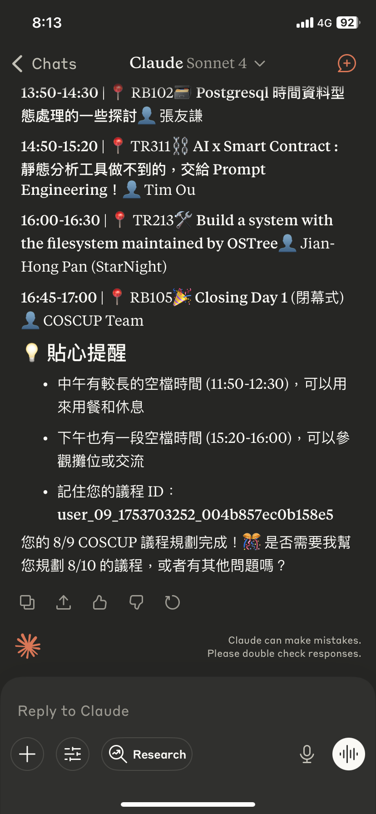
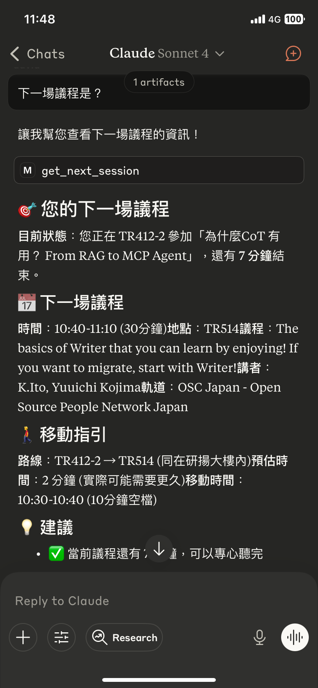

# MCP-COSCUP

<div align="center">
  
  
  [](README.md) [](README-zh.md)
</div>

## 這是什麼？

參加過 COSCUP 的朋友都知道，每年的議程都超豐富，光是看議程表就眼花撩亂。這個專案讓你可以直接跟 AI 聊天來管理你的 COSCUP 行程。

使用流程很簡單：
1. **事先規劃** - 用我們的 MCP tool 安排整天的行程，選擇你想參加的議程
2. **會議當天** - 問 AI「what's next」，它會根據你事先安排的行程和現在時間，告訴你現在該在哪、下一場在哪邊、怎麼走、要花多少時間
3. **即時查詢** - 想知道「TR211 現在在講什麼」或「TR412 下一場議程是什麼」，直接問就好

## 🎯 實際使用效果

**完成規劃後的完整議程：**


**規劃完成並獲得提醒：**



安排完行程後，系統會：
- 顯示完整的議程統計和時間安排
- 提供貼心提醒（用餐時間、空檔時間等）
- 給你一個專屬的 session ID 用於後續查詢

**會議當天的即時查詢：**



安排完之後就可以隨時問 AI 各種問題：
- 「下一場議程是什麼？」
- 「TR212 現在在講什麼？」  
- 「我還有多久到下一場？」
- 「怎麼走到 RB105？」

**⚠️ 使用提醒：**
- 安排行程本身會消耗較多 token
- 互動過程會有些慢，請耐心等待
- 建議一次完成整天的規劃，避免重複安排

---

## 怎麼使用？

我們提供雲端 MCP 服務，支援多種 Claude 客戶端：

### 💻 Claude Code（命令行工具）

**🚀 一行指令安裝（最簡單）**

```bash
# 安裝遠端 MCP 服務
claude mcp add --transport http coscup-remote https://mcp-coscup-scnu6evqhq-de.a.run.app/mcp -s user

# 如果要移除
claude mcp remove coscup-remote -s user
```

### 📱 Claude Desktop（桌面應用）

#### **Step 1: 下載 Claude Desktop**
前往 [Claude Desktop](https://claude.ai/download) 下載並安裝

#### **Step 2: 設定 MCP 連接**

**🎯 使用 UI 界面設定（推薦）**

1. **開啟設定頁面**
   - **macOS**: `Claude Desktop` → `Settings` → `Developer`
   - **Windows**: `File` → `Settings` → `Connectors`

2. **點擊「Add custom connector」**
   
   

3. **填入連接資訊**
   - **名稱**: `mcp-coscup`
   - **URL**: `https://mcp-coscup-scnu6evqhq-de.a.run.app/mcp`
   - OAuth Client ID 和 Secret 留空即可

4. **點擊「Add」完成設定**

<details>
<summary>📝 手動編輯配置檔（備用方法）</summary>

如果 UI 界面不可用，可以手動編輯配置檔：

**配置檔位置：**
- **macOS**: `~/Library/Application Support/Claude/claude_desktop_config.json`
- **Windows**: `%APPDATA%/Claude/claude_desktop_config.json`

**配置內容：**
```json
{
  "mcpServers": {
    "coscup-remote": {
      "command": "npx",
      "args": [
        "@anthropic-ai/mcp-client-http",
        "https://mcp-coscup-scnu6evqhq-de.a.run.app/mcp"
      ]
    }
  }
}
```

設定完成後重啟 Claude Desktop。

</details>

### 🔗 其他 MCP 兼容工具

我們的 MCP 服務遵循標準協議，理論上支援所有 MCP 兼容的客戶端。

**服務端點**: `https://mcp-coscup-scnu6evqhq-de.a.run.app/mcp`

如果你在使用其他工具（如自製的 MCP 客戶端、第三方整合工具等），歡迎：
- 📝 提交 Issue 分享你的使用經驗
- 🔧 貢獻設定說明到我們的文檔
- 💡 告訴我們需要什麼額外支援

### ✅ 測試設定

設定完成後，試試這個指令：

```
你：幫我安排 Aug.9 COSCUP 的行程
```

如果看到 Claude 開始顯示議程選項，就表示設定成功了！

---

### 💻 方式二：本地安裝

如果你想要本地運行或進行開發，有兩種方式：

#### **📦 下載預編譯版本（最簡單）**

不需要安裝 Go 開發環境，直接下載現成的程式：

**需要什麼**
- Claude Code 或 Claude Desktop ([點這裡下載](https://claude.ai/download))

**🚀 安裝步驟**

1. **下載對應系統的程式**
   - 前往 [Releases 頁面](https://github.com/davidleitw/mcp-coscup/releases)
   - 選擇最新版本下載：
     - **macOS (Intel)**: `mcp-coscup-darwin-amd64`
     - **macOS (Apple Silicon)**: `mcp-coscup-darwin-arm64`
     - **Linux**: `mcp-coscup-linux-amd64`
     - **Windows**: `mcp-coscup-windows-amd64.exe`

2. **設定執行權限**
   
   **macOS/Linux:**
   ```bash
   # 下載後設定執行權限
   chmod +x mcp-coscup-*
   
   # 移動到方便的位置（可選）
   mkdir -p ~/.local/bin
   mv mcp-coscup-* ~/.local/bin/mcp-coscup
   ```
   
   **Windows:**
   ```cmd
   # 下載 .exe 檔案後，可直接執行
   # 建議移動到固定位置，例如：
   mkdir C:\mcp-tools
   move mcp-coscup-windows-amd64.exe C:\mcp-tools\mcp-coscup.exe
   ```

3. **註冊到 Claude**
   
   **macOS/Linux:**
   ```bash
   # 使用完整路徑註冊
   claude mcp add mcp-coscup /path/to/mcp-coscup -s user
   
   # 如果移動到 ~/.local/bin
   claude mcp add mcp-coscup ~/.local/bin/mcp-coscup -s user
   ```
   
   **Windows:**
   ```cmd
   # 使用完整路徑註冊
   claude mcp add mcp-coscup C:\mcp-tools\mcp-coscup.exe -s user
   ```

4. **Claude Desktop 用戶額外設定**
   
   如果使用 Claude Desktop，需要手動編輯配置檔：
   
   **配置檔位置：**
   - **macOS**: `~/Library/Application Support/Claude/claude_desktop_config.json`
   - **Windows**: `%APPDATA%/Claude/claude_desktop_config.json`
   
   **配置內容範例：**
   ```json
   {
     "mcpServers": {
       "mcp-coscup": {
         "command": "/Users/你的用戶名/.local/bin/mcp-coscup"
       }
     }
   }
   ```
   
   **Windows 用戶配置範例：**
   ```json
   {
     "mcpServers": {
       "mcp-coscup": {
         "command": "C:\\mcp-tools\\mcp-coscup.exe"
       }
     }
   }
   ```

5. **測試安裝**
   ```
   你：幫我安排 Aug.9 COSCUP 的行程
   ```

#### **⚙️ 從原始碼編譯**

如果你想要進行開發或修改：

**需要什麼**
- Claude Code 或 Claude Desktop ([點這裡下載](https://claude.ai/download))
- Git 和 Go 開發環境

#### **🚀 一行指令安裝（推薦）**

```bash
# 1. 下載專案
git clone https://github.com/davidleitw/mcp-coscup.git
cd mcp-coscup

# 2. 一鍵安裝本地版本
make install-local

# 如果要移除
make uninstall-local
```

#### **⚙️ 互動式安裝**

```bash
# 讓你選擇本地或遠端安裝
make install
```

#### **🔄 其他指令**

```bash
# 直接安裝遠端版本（不需要編譯）
make install-remote

# 檢查 MCP 狀態
make claude-status

# 移除遠端版本
make uninstall-remote
```

#### **手動安裝**

如果你喜歡手動控制每個步驟：

```bash
# 1. 編譯程式
make build

# 2. 註冊到 Claude Code
claude mcp add mcp-coscup ./bin/mcp-coscup -s user

# 3. 重啟 Claude Desktop（如果使用 Desktop 版本）
```

#### **本地安裝的設定檔**
如果使用本地安裝，設定檔內容應該是：
```json
{
  "mcpServers": {
    "mcp-coscup": {
      "command": "./bin/mcp-coscup"
    }
  }
}
```

---

## 📱 使用範例

**事先規劃行程：**

用「幫我規劃8/9coscup的行程」開始：

```
你：幫我規劃8/9coscup的行程

AI：我來幫您規劃 8/9 COSCUP 的行程！讓我先為您開始規劃這一天的議程安排。

太好了！我已經為您建立了 8/9 的行程規劃。您的個人議程 ID 是：user_09_1753703252_004b857ec0b158e5

**開幕主題演講**
W3BES9 - COSCUP 2025: Welcome Day 1
時間：09:00-09:35
地點：RB105
講者：COSCUP Team
語言：漢語

這是 COSCUP 2025 第一天的開幕式，建議您參加來了解整個活動的安排和精神！

接下來您想選擇哪個時段的議程呢？您可以：
• 直接告訴我議程代碼（如：W3BES9）來選擇
• 或者說「我要選這個」來選擇開幕式
• 想了解更多議程細節，請提供議程代碼

您想要參加開幕式嗎？還是想看看其他時段有什麼選項？

你：參加開幕式

AI：太好了！已經為您選擇了開幕式。您的議程 ID：user_09_1753703252_004b857ec0b158e5

現在讓我為您展示接下來可以選擇的 25 個議程，按主題分類：
[繼續展示更多議程選項...]
```

**會議當天查詢下一場議程：**
```
你：下一場議程是？

AI：讓我幫您查看下一場議程的資訊！

**您的下一場議程**

目前狀態：您正在 TR412-2 參加「為什麼CoT 有用？ From RAG to MCP Agent」，還有 7 分鐘結束。

**下一場議程**
時間：10:40-11:10 (30分鐘)
地點：TR514
議程：The basics of Writer that you can learn by enjoying! If you want to migrate, start with Writer!
講者：K.Ito, Yuuichi Kojima
軌道：OSC Japan - Open Source People Network Japan

**移動指引**
路線：TR412-2 → TR514 (同在研揚大樓內)
預估時間：2 分鐘 (實際可能需要更久)
移動時間：10:30-10:40 (10分鐘空檔)

**建議**
• 當前議程還有 7 分鐘，可以專心聽完
• 結束後有 10 分鐘時間移動，時間充裕
• 兩個教室都在同一棟建築內，移動很方便
• 如果需要可以順便上洗手間或喝水

您目前的時間安排很順利！
```

**其他即時查詢：**
```
你：TR212 現在在講什麼？

AI：TR212 現在正在進行：
10:10-10:40 「透過 gRPC-Gateway 使用 Go 構建 RESTful API」

你：TR212 下一場是什麼？

AI：TR212 下一場議程：
11:10-11:40 「Golang clean arch framework for beginners」
```

就是這麼簡單，像聊天一樣輕鬆管理你的 COSCUP 行程。


---

## 🔧 故障排除

### 常見問題

#### ❓ **設定後 Claude Desktop 沒有反應**
1. 檢查設定檔格式是否正確（JSON 語法）
2. 確認已經重啟 Claude Desktop
3. 檢查網路連線是否正常

#### ❓ **找不到設定檔位置**
```bash
# macOS
open "~/Library/Application Support/Claude/"

# Windows (在檔案總管地址欄輸入)
%APPDATA%/Claude/
```

#### ❓ **HTTP 遠端連線失敗**
```bash
# 重新安裝遠端服務
claude mcp remove coscup-remote -s user
claude mcp add --transport http coscup-remote https://mcp-coscup-scnu6evqhq-de.a.run.app/mcp -s user

# 或改用本地安裝
make install-local
```

#### ❓ **Claude Code 指令無法使用**
```bash
# 檢查是否已安裝
which claude

# 確認 MCP 狀態
claude mcp list
```

#### ❓ **Binary 下載版本無法執行**
```bash
# macOS/Linux: 確認執行權限
chmod +x mcp-coscup-*

# 測試程式是否正常
./mcp-coscup-* --help  # macOS/Linux
mcp-coscup.exe --help  # Windows
```

#### ❓ **從原始碼編譯失敗**
```bash
# 確認 Go 版本 (需要 1.21+)
go version

# 重新編譯
make clean && make build
```


---

## 🚀 想要貢獻開發？

歡迎大家貢獻想做的功能或提出 issue！

### 🤝 歡迎一起改進！

不管你是：
- **想要新功能** - 在 [Issues](https://github.com/davidleitw/mcp-coscup/issues) 告訴我們你希望有什麼功能
- **發現 Bug** - 實際使用時遇到問題，歡迎回報！ 
- **想寫程式** - 直接來個 Pull Request

**🚧 目前想要加的功能：**

- **批量議程建立** - 讓用戶可以一次輸入一連串的議程代碼（如：`W3BES9,ABC123,DEF456`），系統直接幫忙建立完整行程。這樣可以避免來回交互浪費太多 token，適合已經知道想參加哪些議程的用戶。

- **行程分享功能** - 開發一個分享工具，讓後端回傳特定的 prompt，這樣 LLM 就能讀取朋友已經建立的行程表。用戶可以分享自己的行程安排，或查看朋友的規劃作為參考。

- **議程共筆連結** - 想要加上獲得某個議程共筆的功能，但是現在連結還沒有出來，還在思考是要開一個獨立的 MCP tool 還是在現有的工具中多回傳這個資訊（理論上 LLM 能把資訊抽出來）。

有興趣的人歡迎來討論或貢獻這些功能！

**提交程式改動：**
1. Fork 這個 repo
2. 開個新 branch: `git checkout -b feature/我的新功能`
3. 寫程式 + 測試: `make test && make install-local`
4. Commit + Push
5. 開 Pull Request

**我們希望這個工具能真正幫助到參加 COSCUP 的會眾，讓大家在會場能更輕鬆地安排行程、找到想聽的議程！**

有任何想法都歡迎分享，一起讓 COSCUP 體驗變得更好！

### 📦 開發環境設定

**你需要什麼：**
- [Claude Code 或 Claude Desktop](https://claude.ai/download)
- [Go 1.21+](https://golang.org/dl/)

**任何平台都可以：**
- 🐧 Linux
- 🍎 macOS (Intel 和 Apple Silicon 都支援)
- 💻 Windows

### 🔧 開始開發

**一步到位：**
```bash
# 1. 把專案抓下來
git clone https://github.com/davidleitw/mcp-coscup.git
cd mcp-coscup

# 2. 編譯 + 安裝到你的 Claude 裡面
make install-local

# 3. 直接在 Claude Code 或 Claude Desktop 測試
# 問問看：「幫我安排 Aug.9 COSCUP 的行程」
```

**如果你是 Windows 用戶 --- (作者沒有測試過XD)：**
```bash
# Windows 也可以編譯成 .exe
make build-windows

# 然後手動註冊到 Claude Code
claude mcp add mcp-coscup ./bin/mcp-coscup.exe -s user
```

### 🔄 開發流程

```bash
# 1. 改程式碼
# 用你喜歡的編輯器改 mcp/ 目錄下的檔案

# 2. 測試看看
make test

# 3. 重新編譯 + 安裝
make install-local

# 4. 在 Claude 裡面測試
# 直接問 COSCUP 相關問題，看功能有沒有正常

# 5. 功能 OK 的話，commit 你的改動
git add .
git commit -m "修正了某某功能"
```

### 🛠️ 常用指令

```bash
# === 編譯相關 ===
make build              # Linux 版本（預設）
make build-mac          # macOS 版本
make build-mac-arm      # Apple Silicon 版本
make build-windows      # Windows 版本
make build-all          # 一次編譯所有平台

# === 測試相關 ===
make test               # 跑單元測試
make test-verbose       # 詳細測試輸出

# === Claude 整合 ===
make install-local      # 安裝本地版本到 Claude
make install-remote     # 安裝雲端版本到 Claude
make claude-status      # 看看 Claude 裡面的 MCP 狀態
make uninstall-local    # 移除本地版本

# === 其他 ===
make clean              # 清理編譯產物
make help               # 看所有可用指令
```

### 🧪 怎麼測試你的改動

**本地測試：**
```bash
# 重新安裝到 Claude
make install-local

# 在 Claude Code 或 Claude Desktop 裡測試
# 試試這些問句：
# - "幫我安排 Aug.9 COSCUP 的行程"
# - "TR212 現在在講什麼？"
# - "what's next"
```


### 📂 專案結構（給想深入了解的人）

```
mcp-coscup/
├── cmd/server/         # 主程式進入點
├── mcp/               # 核心邏輯
│   ├── server.go      # MCP 伺服器
│   ├── tools.go       # 各種 mcp tool 定義
│   ├── session.go     # session related
│   └── data.go        # COSCUP 資料處理
├── data/              # COSCUP 議程資料
├── deploy/            # 部署腳本
└── bin/               # 編譯出來的程式
```

### 🐛 遇到問題？

**編譯失敗：**
```bash
# 檢查 Go 版本
go version

# 清理重來
make clean
make build
```

**Claude 連不到：**
```bash
# 檢查 Claude Code 有沒有裝
which claude

# 檢查 MCP 狀態
make claude-status

# 重新安裝
make uninstall-local
make install-local
```


## 授權

GNU GENERAL PUBLIC LICENSE 

## 感謝

感謝 COSCUP 社群和所有志工讓這個專案得以實現。

---

<div align="center">
  Made with ❤️ for COSCUP Community
</div>
